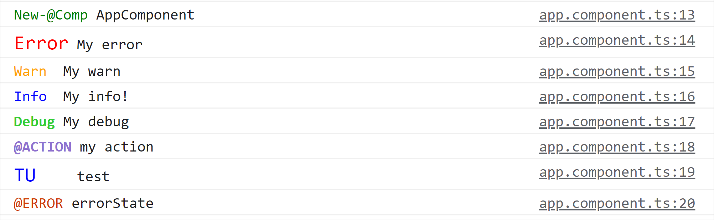
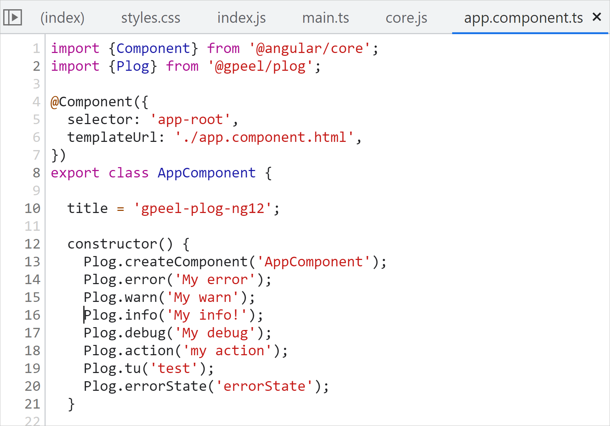

# Colorful logs with @gpeel/plog-ng12

This library was generated with [Angular CLI](https://github.com/angular/angular-cli) version 12.2.0.

For Angular 12.x.y => use @gpeel/plog 12.1.0 or more recent

For Angular 11.x.y => use @gpeel/plog@11.0.1 (last version for angular 11)

npm repo:
https://www.npmjs.com/package/@gpeel/plog

Github repo at :
https://github.com/gpeel/plog


Medium story : https://medium.com/p/62dd10ba3d10/edit

## INSTALLATION

    ng i @gpeel/plog

## Example of what you get



### You get obvious **colors** and also keep the **logs clickable** to navigate to your source code.

To get those style the loggers have been defined as follow:

````typescript
export const environment = {
  production: false,
  plog: {
    createComponent: ['color:green;', 'New-@Comp'],

    error: 'color:red; font-size:1rem;',
    warn: 'color:orange',
    info: 'color:blue',
    debug: 'color:limegreen;font-weight:bold',

    action: ['color:#8f72cf; font-weight:bold;', '@ACTION'], // to log inside Action method
    tu: ['color:blue; font-size:1rem;', 'TU'],
    errorState: ['color:#cf3c04', '@ERROR'], // to log error in Store

  }
};
````

As you can see, on the right of this image app.component.ts:16 for example.



## DECLARATION

````typescript
import {PlogModule} from '@gpeel/plog';
import {environment} from '../environments/environment';

@NgModule({
  declarations: [
    AppComponent
  ],
  imports: [
    BrowserModule,
    PlogModule.forRoot(environment) // <<< HERE, takes into account you loggers definition in environment.ts
  ],
  providers: [],
  bootstrap: [AppComponent]
})
export class AppModule {
}
````

## PROD environment.prod.ts

Your ./environments/environments.ts and environments-prod.ts would typically look like :

````typescript

export const environment = {
  production: false,
  plog: {
    error: 'color:red',
    warn: 'color:orange',
    // info: 'color:blue',
    // debug: 'color:limegreen;font-weight:bold',
  }
};
````

## DEV environment.ts

And your developpment environment.ts would activate much more loggers (here all are activated) :

````typescript
export const environment = {
  production: false,
  plog: {
    debug: 'color:limegreen;font-weight:bold',
    info: 'color:blue',
    error: 'color:red',
    warn: 'color:orange',

    // Performance logs
    perf: 'color:darkturquoise',
    perfComponent: ['color:darkturquoise', 'PERF-¤¤'],
    perfCD: ['color:darkturquoise', 'PERF-¤¤¤¤¤¤¤'],
    perfDom: ['color:darkturquoise', 'PERF-¤-¤-¤-¤'],

    // NG hooks
    ngOnChanges: ['color:orange', 'OnChange'],
    ngOnInit: ['color:orange', 'OnInit'],
    ngOnDestroy: ['color:orange', 'OnDestroy'],
    ngDoCheck: ['color:orange', 'DoCheck'],
    ngAfterContentInit: ['color:orange', 'AfterContentInit'],
    ngAfterContentChecked: ['color:orange', 'AfterContentChecked'],
    ngAfterViewInit: ['color:orange', 'AfterViewInit'],
    ngAfterViewChecked: ['color:orange', 'AfterViewChecked'],

    // constructor logs
    create: ['color:green', 'new'],
    createComponent: ['color:green', 'New-@Comp'],
    createDirective: ['color:green', 'New-@Dir'],
    createService: ['color:green', 'New-Svc'],
    createPipe: ['color:green', 'New-@Pipe'],
    createGuard: ['color:green', 'New-@Guard'],
    createResolver: ['color:green', 'New-@Resolver'],

    // NG types
    resolve: 'color:brown',
    guard: 'color:sandybrown',
    validator: 'color:plum',
    pipe: 'color:brown',
    callback: 'color:violet',

    state: 'color:blueviolet', // Redux style or BehaviorSubject, as you want
    // specific logs for NGXS, Akita
    action: ['color:#8f72cf', '@ACTION'], // to log inside Action method
    select: ['color:#84467c', '@SELECT'], // to log inside select method
    errorState: ['color:#cf3c04', '@ERROR'], // to log error in Store
    effect: ['color:#8F72CF;font-weight:bold;', '@EFFECT'], // to log inside effect method (even if using @Effet is not advised)
    cache: ['color:blueviolet', '@EFFECT'],

    // Specific loggers for @gpeel/my-validators
    validationCompute: ['color:orange', '@VALID'], // tracing validators when they compute
    validationErrorMsgRefresh: ['color:orange', '@VALID_PERF'], // tracing refresh of <my-error-msg>
    validationErrorMsgCreation: ['color:orange', '@ERROR_MSG_NEW'], // tracing creation of component <my-error-msg>
    errorMsg: ['color:orange', '@VALID'], // used by <error-msg> deprecated

    // network actions (interceptors)
    network: ['color:blue', 'HTTP'],
    networkRequest: ['color:blue', 'HttpRequest'],
    networkResponse: ['color:blue', 'HttpResponse'],
    networkError: ['color:red', 'HTTP-Error'],
    networkCreate: ['color:green', 'NEW-HTTP'],

    httpCall: ['color:springgreen', 'HTTP-CALL'], // http prefix : for service logic
    httpSuccess: ['color:springgreen', 'HTTP-SUCCESS'],
    httpError: ['color:red', 'HTTP-ERROR'],
    httpDebug: ['color:springgreen', 'HTTP-TAP'],

    obsSubscribe: ['color:springgreen', 'OBS-sub'],
    obsSuccess: ['color:springgreen', 'OBS-SUCCESS'],
    obsError: ['color:red', 'OBS-ERROR'],
    obsDebug: ['color:springgreen', 'OBS-DEBUG'],


    // tests
    tu: ['color:green', 'tu'],
    tuBeforeEach: ['color:slateblue', 'tu-BEFORE-EACH'],
    tuBeforeAll: ['color:slateblue', 'tu-BEFORE-ALL'],
    tuAfterEach: ['color:tomato', 'tu-AFTER-EACH'],
    tuAfterAll: ['color:tomato', 'tu-AFTER-ALL'],
    tuArrange: ['color:blue', 'tu'],
    tuAct: ['color:blueviolet', 'tu'],
    tuAssert: ['color:brown', 'tu'],
    ti: ['color:green', 'ti'],
    te2e: ['color:green', 'e2e'],

    // colors
    pink: ['color:#FF40BD;', '######'], // pink flashy
    red: 'color:red', // red without the console.error() stacktrace
    orange: ['color:orange', '######'],
    green: ['color:springgreen', '######'],
    blue: ['color:cadetblue', '######'],
    lightBlue: ['color:darkturquoise', '######'],
    violet: ['color:blueviolet', '######'],

    // same color-loggers with a prefix 'color' (easier to find with intellisense)
    colorPink: ['color:#FF40BD;', '######'], // pink flashy
    colorRed: 'color:red', // red without the console.error() stacktrace
    colorOrange: ['color:orange', '######'],
    colorGreen: ['color:springgreen', '######'],
    colorBlue: ['color:cadetblue', '######'],
    colorLightBlue: ['color:darkturquoise', '######'],
    colorViolet: ['color:blueviolet', '######']
  }
};

````

To deactivate a logger, simply comment its line.

You can change the CSS (color or anything else), and the prefix.

You define in environment.plog all activated loggers. if a logger name is not present, there is no log for this logger.
example, here if "debug" is not defined, Plog.debug( ...string[]) will not log. S you can keep the codeline in your code
even in production, you just have to comment the logger's line in environment.ts.

you can choose the color and the prefix :

        aLogger: [ YourCSS, YourLogPrefix>],

example

        action: ['color:orange', '@ACTION'],

Plog.action("message"); will log

        @ACTION: message

You can see ALL available loggers above in DEV/environment.ts

Typescript source codes are delivered inside the installed packge in node_modules/@gpeel/plog/src/lib


